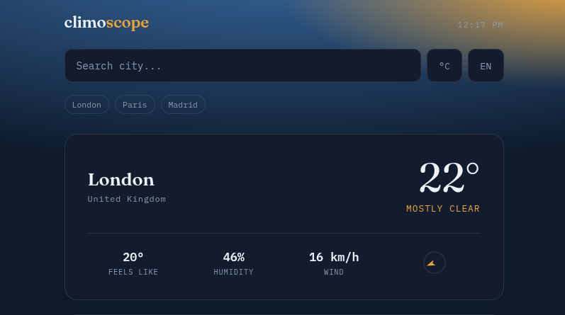

# climoscope

A minimalist weather app in plain HTML/CSS/JS — no frameworks, no build tools, no API key. Uses the [Open-Meteo API](https://open-meteo.com/) for geocoding and forecasts.

🔗 **[climoscope-drab.vercel.app](https://climoscope-drab.vercel.app/)**



## Features

- City search with autocomplete
- Recent cities, persisted in `localStorage`
- Current weather: temperature, feels-like, humidity, and wind (with SVG compass)
- Hourly forecast (next 24h)
- 7-day forecast
- °C/°F toggle
- EN/ES language toggle (app loads in English by default)
- Dynamic background based on weather and time of day

## Running it locally

No build step or dependencies to install. Since the files use `fetch` and relative paths, they need to be served over HTTP (opening `index.html` directly via `file://` can fail due to CORS in some browsers). Any static server works, for example:

```bash
python3 -m http.server 8000
```

then open `http://localhost:8000` in your browser.

## Structure

```
index.html       page structure
css/style.css     styles
js/app.js         logic: geocoding, weather fetch, render, state
```

## Deployment

Published on [Vercel](https://vercel.com/) as a static site, imported directly from this repo (no custom build command or output directory — Vercel serves `index.html` from the root as-is). Every push to `main` deploys automatically to https://climoscope-drab.vercel.app/.
